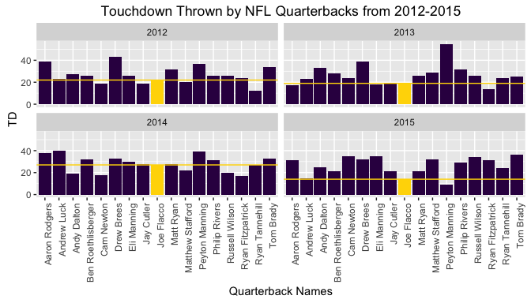

# Is Joe Flacco Elite?
Ted Hwang  
June 14, 2016  
## Preface
The purpose of this document is to showcase my technical abilites and I want to limit the length of this document to three pages so, the data analysis will be brief. This document will showcase my ability to do data analysis with R and SQL. In fact, this document is written in markdown and processed through R. Most subsetting techniques are written in SQL syntax and the graphs are generated through ggplot. All of the code will not be shown in this document due to redudancy. For example, in the background, there exists 4 lines of code to load 4 files into R but the document will only show one line of code.

## Introduction
A blogger from this website:http://blog.estately.com/2016/05/you-wont-believe-the-questions-each-state-googles-more-than-any-other-state, looked at the questions each state googled more than any other state. My home state of Maryland googled, "Is Joe Flacco elite" and so I wanted to answer this question. I defined 'elite' as a quarterback who is better than his peers at throwing touchdowns per season over a period of 4 seasons. I've collected the data from this website:http://www.pro-football-reference.com/years/2015/passing.htm#passing. I will be using these packages

```r
library(sqldf)
library(ggplot2)
library(dplyr)
```
## Loading and Cleaning the Data
For this project, I loaded 4 csv files from 2012 to 2015 into R as data frames. The files hold stats on 29 qbs from each season. To process the data, it is required that each of these loaded data frames have a new column with the year included. I use SQL syntax to subset the data frame into a smaller one with only the variables that are needed. I cleaned the names of the QBs due to some of their names ending with a "*" or "+" in the original data. I use the %in% operator to find the QBs that have information about them for all four years (rookie qbs in 2015 didn't play in 2012). I combined the 4 data frames into a single data frame. SQL syntax is used to find how many unique qbs this data frame includes which is 17.  

```r
    data12 <- read.csv("./years_2012_passing_passing.csv",header=TRUE,nrow=29)
    data12 = mutate(data12,year=2012)
    sub12_td = sqldf('select X,TD,Rate,year from data12 order by TD desc')
    sub12_td$X = gsub("\\*||\\+","",sub12_td$X)
    temp1 = sub12_td[sub12_td$X %in% sub13_td$X,]
    temp2 = temp1[temp1$X %in% sub14_td$X,]
    qb_names = temp2[temp2$X %in% sub15_td$X,]
    comb_year = rbind(sub12_td,sub13_td,sub14_td,sub15_td)
    sqldf('select count(distinct X) as Number_of_QBs from qb_names') 
```

```
##   Number_of_QBs
## 1            17
```

##Data Processing/Plotting
Ggplot is used to plot a facet of bar graphs of touchdowns scored by each quarterback from each season between 2012 and 2015. The gold bars show how many touchdowns Joe has scored in each of those season. A gold line is placed as reference to show how Joe has performed relatitve to his peers.    

```r
    g = ggplot(comb_year,aes(X,TD))
    g + facet_wrap(~year) +    
    geom_bar(stat='identity',fill='#350A50')+
    geom_bar(stat='identity',data=joe,aes(X,TD),fill='gold') +
    theme(axis.text.x=element_text(angle=90,hjust=1)) +
    geom_hline(aes(yintercept=TD),joe,color='gold') + 
    labs(title='Touchdown Thrown by NFL Quarterbacks from 2012-2015') +
    xlab("Quarterback Names")
```

<!-- -->

##Analysis  
I use SQL syntax and subqueries to find how many quarterbacks had more touchdowns than Joe in each of the 4 season. Joe is not an elite quarterback. In each of the 4 season, more than 10 quarterbacks scored more touchdowns than he did. The bar graph also shows that Joe does nothing remarkable with regards to scoring touchdowns.  

```r
    hi_joe12 = sqldf('select year, count(X) as QBs_w_More_TDs from comb_year where TD > 
                    (select TD from comb_year where X = "Joe Flacco" and year = 2012) 
                    and year=2012')
    comb_joe = rbind(hi_joe12,hi_joe13,hi_joe14,hi_joe15)
```

```
##   year QBs_w_More_TDs
## 1 2012             12
## 2 2013             12
## 3 2014             10
## 4 2015             15
```

##Conclusion
A data analysis was performed using R and sql syntax to see if Joe Flacco is an elite quarterback. The data was collected from www.pro-footbal-reference.com. My definition of an elite quarteback is a player who outscores his peers in touchdowns. From my data analysis it was shown that Joe Flacco is not an elite quarterback. In 4 seasons, between 2012 and 2015, it was shown that at least 10 quarterbacks outscored Joe in touchdowns in each season. Due to a page limit, this document only looked at 1 statistic, touchdowns. It is very possible, with R, to look at many other statistics that are awarded to quarterbacks and see which statistic Joe Flacco might be elite at. 


    
